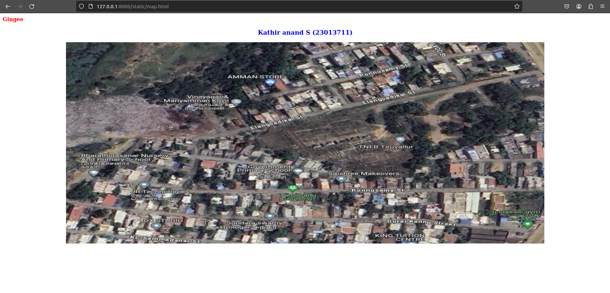
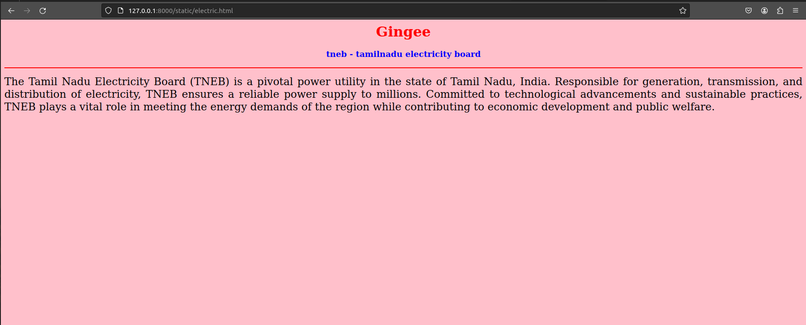
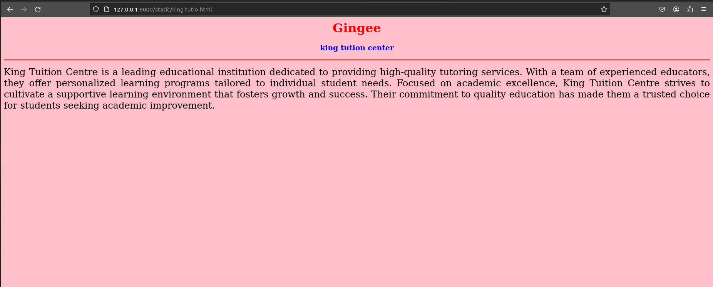
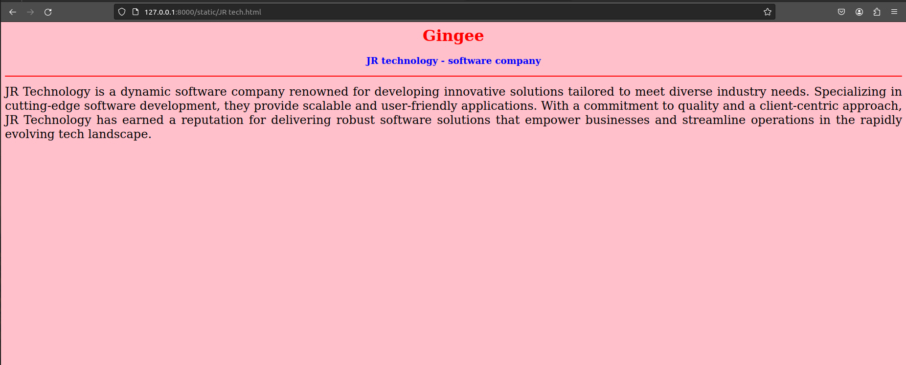
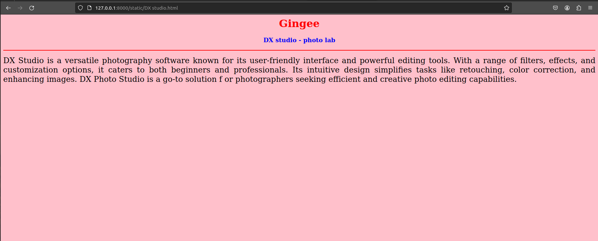

# Places Around Me
## AIM:
To develop a website to display details about the places around my house.

## Design Steps:

### Step 1:
Create a Django admin interface.

### Step 2:
Download your city map from Google.

### Step 3:
Using ```<map>``` tag name the map.

### Step 4:
Create clickable  regions in the image using ```<area>``` tag.

### Step 5:
Write HTML programs for all the regions identified.

### Step 6:
Execute the programs and publish them.

## Code:
```

map.html

<html>
<head>
<title>My City</title> 
</head>
<body>
<hi align="center">
<font color="red"><b>Gingee</b></font>
</h1>
<h3 align="center">
<font color="blue"><b>Kathir anand S (23013711)</b></font>
</h3>
<center>

<map name="MyCity">
<area shape="rect" coords="700,200,500,300" href="home.html" title="My City">
<area shape="circle" coords="1500,100,900,900" href="electric.html" title="TNEB Trl">
<area shape="circle" coords="1200,100,900,900" href="king tution.html" title="king tution">
<area shape="circle" coords="680,100,900,900" href="JR tech.html" title="JR technology">
<area shape="rect" coords="850,100,900,900" href="DX studio.html" title="DX studio">
</map>
</center>
</body>
</html>

home.html

<html>
<head>
<title>My City</title>
</head>
<body bgcolor="pink">
<h1 align="center">
<font color="red"><b>Gingee</b></font>
</h1>
<h3 align="center">
<font color="blue"><b>Tiruvallur - My City</b></font>
</h3>
<hr size="3" color="red">
<p align="justify">
<font face="Georgia" size="5">
Tiruvallur, a historic city in Tamil Nadu, India, radiates cultural richness and vibrant traditions. 
Renowned for its ancient temples like the Sri Veeraraghava Perumal Temple, the city echoes with 
spirituality. Nestled amidst lush greenery, Tiruvallur embraces both urban development and natural 
beauty. The city's strategic location near Chennai enhances its economic significance. Residents take
pride in the harmonious blend of tradition and modernity. With a diverse community, bustling markets, 
and educational institutions, Tiruvallur thrives as a dynamic cultural hub. Its historical significance, 
cultural heritage, and forward-looking spirit make Tiruvallur a unique and thriving city in Tamil Nadu.
</p>
</body>
</html>

electric.html

<html>
<head>
<title>My City</title>
</head>
<body bgcolor="pink">
<h1 align="center">
<font color="red"><b>Gingee</b></font>
</h1>
<h3 align="center">
<font color="blue"><b>tneb - tamilnadu electricity board</b></font>
</h3>
<hr size="3" color="red">
<p align="justify">
<font face="Georgia" size="5">
The Tamil Nadu Electricity Board (TNEB) is a pivotal power utility in the state of Tamil Nadu, India. Responsible for generation, transmission, and distribution of electricity, TNEB ensures a reliable power supply to millions. Committed to technological advancements and sustainable practices, TNEB plays a vital role in meeting the energy demands of the region while contributing to economic development and public welfare.
</p>
</body>
</html>

king tutio.html

<html>
<head>
<title>My City</title>
</head>
<body bgcolor="pink">
<h1 align="center">
<font color="red"><b>Gingee</b></font>
</h1>
<h3 align="center">
<font color="blue"><b>king tution center</b></font>
</h3>
<hr size="3" color="red">
<p align="justify">
<font face="Georgia" size="5">
King Tuition Centre is a leading educational institution dedicated to providing high-quality tutoring services. 
With a team of experienced educators, they offer personalized learning programs tailored to individual student needs. 
Focused on academic excellence, King Tuition Centre strives to cultivate a supportive learning environment that fosters 
growth and success. Their commitment to quality education has made them a trusted choice for students seeking academic improvement.
</p>
</body>
</html>

JR tech.html

<html>
<head>
<title>My City</title>
</head>
<body bgcolor="pink">
<h1 align="center">
<font color="red"><b>Gingee</b></font>
</h1>
<h3 align="center">
<font color="blue"><b>JR technology - software company</b></font>
</h3>
<hr size="3" color="red">
<p align="justify">
<font face="Georgia" size="5">
JR Technology is a dynamic software company renowned for developing innovative solutions
tailored to meet diverse industry needs. Specializing in cutting-edge software development, 
they provide scalable and user-friendly applications. With a commitment to quality and a 
client-centric approach, JR Technology has earned a reputation for delivering robust software 
solutions that empower businesses and streamline operations in the rapidly evolving tech landscape.
</p>
</body>
</html>

DX studio.html

<html>
<head>
<title>My City</title>
</head>
<body bgcolor="pink">
<h1 align="center">
<font color="red"><b>Gingee</b></font>
</h1>
<h3 align="center">
<font color="blue"><b>DX studio - photo lab</b></font>
</h3>
<hr size="3" color="red">
<p align="justify">
<font face="Georgia" size="5">
DX Studio is a versatile photography software known for its user-friendly interface and 
powerful editing tools. With a range of filters, effects, and customization options, 
it caters to both beginners and professionals. Its intuitive design simplifies tasks like 
retouching, color correction, and enhancing images. DX Photo Studio is a go-to solution f
or photographers seeking efficient and creative photo editing capabilities.
</p>
</body>
</html>
```
## Output:







## Result:
Write your result